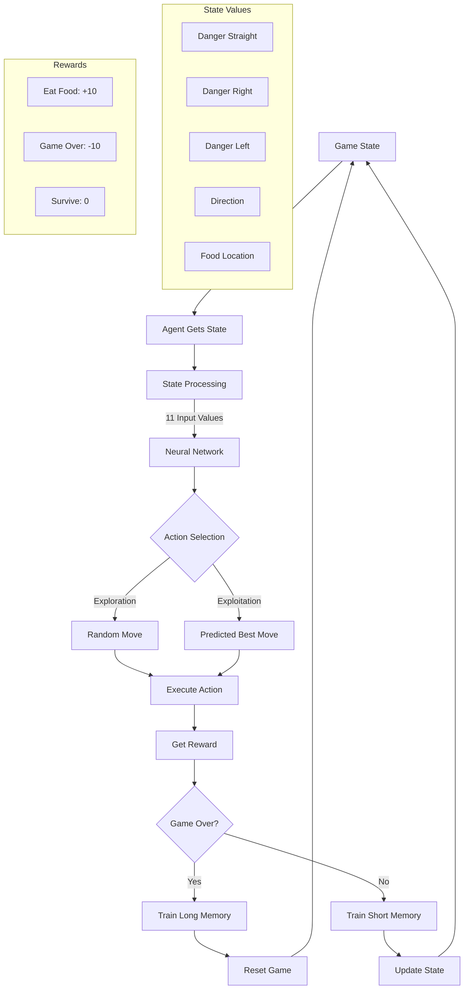

# Snake AI 🐍

<p align="center">
  
</p>

## About The Project

Snake AI is an implementation of the classic Snake game with a reinforcement learning agent that learns to play the game optimally. The project uses PyTorch to create a Deep Q-Learning model that improves its gameplay through experience.

## Features

- Classic Snake game implementation with PyGame
- Deep Q-Learning neural network using PyTorch
- Real-time training visualization
- Performance tracking with matplotlib
- Both human playable and AI training modes

## Demo
https://github.com/user-attachments/assets/177f469d-afe3-4886-83ba-a122f4cde06e

## Learning Process


## Traning process 

The agent uses an epsilon-greedy strategy for exploration :

- Initial random moves for exploration
- Gradually transitions to exploitation of learned patterns
- Stores experiences in memory
- Trains in both short-term and long-term memory phases


## Getting Started

### Prerequisites

```bash
- Python 3.7+
- PyTorch
- Pygame
- Matplotlib
- NumPy
- Python3-tk


